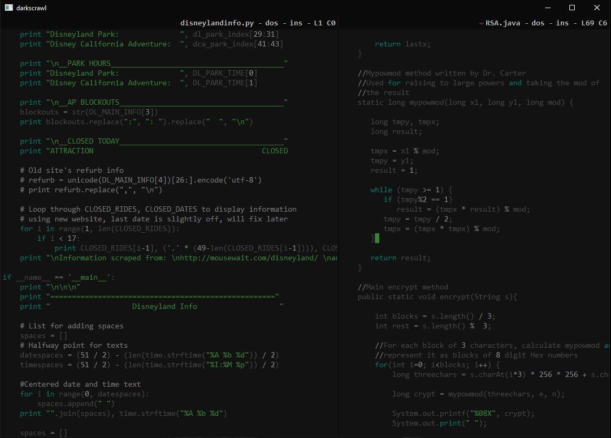

Introducing darkscrawl, a dark and minimal emacs-inspired text editor based on PyQt4 and Python 2.7.

Following the UNIX design philosophy, this program aims to do one thing and do one thing well. Edit text. Coated in a delightfully dark and unobtrusive theme, darkscrawl strives to provide a similar yet re-imagined approach to the functionality and design of emacs. While providing a more user-friendly experience darkscrawl doesn't include any extra bloat that may intimidate new users, providing a raw but familiar style of text editing for new modular programmers.

Some features include:
- Quick and easy open/save keybindings
- Intuitive yet minimal custom directory browser
- Simplified syntax highlighting for easier readability (different themes!)
- Split-window editing
- Quickly create and edit new files in desired location
- Search-in-file queries
- Insert and Navigation editing modes
- Many flavors of darkscrawl's homemade theme
- Current line/character visualization
... and more to come!

To run, simply execute in your favorite terminal:

> python darkscrawl.py

To use your favorte flavor of darkscrawl's homemade theme:

> python darkscrawl.py \<color\>

Colors include:
"green", "red", "blue", "orange", and "yellow"

SCREENSHOTS!

Split-window editing with green flavor

Intuitive in-house directory browser

Happy scrawling!

